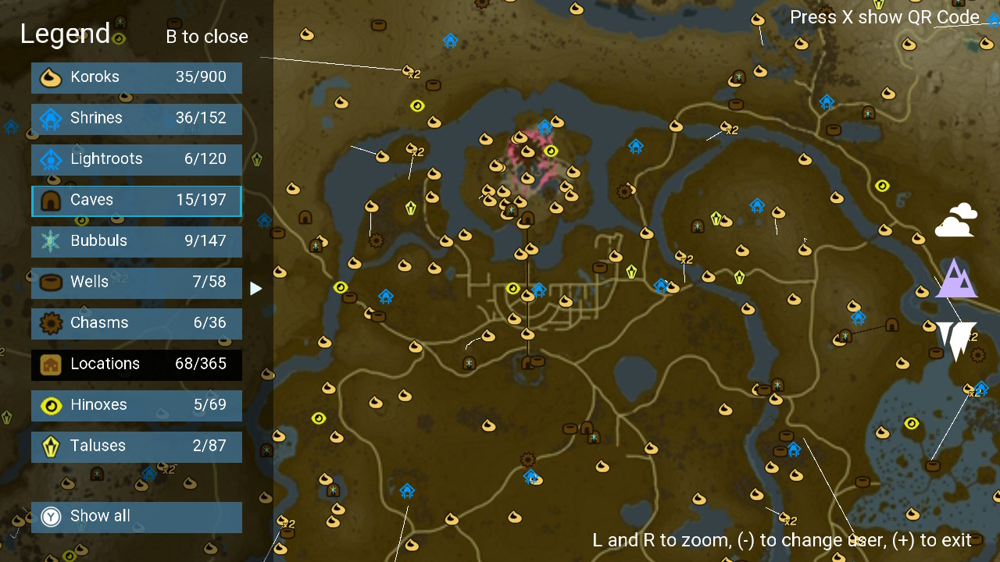
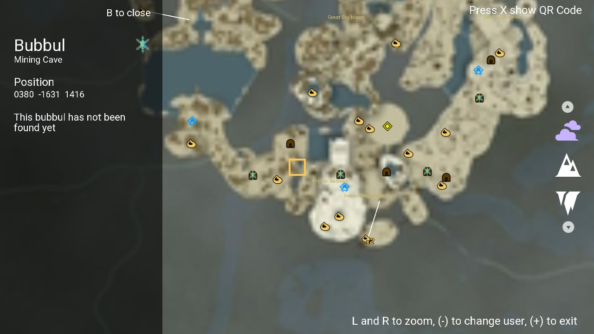
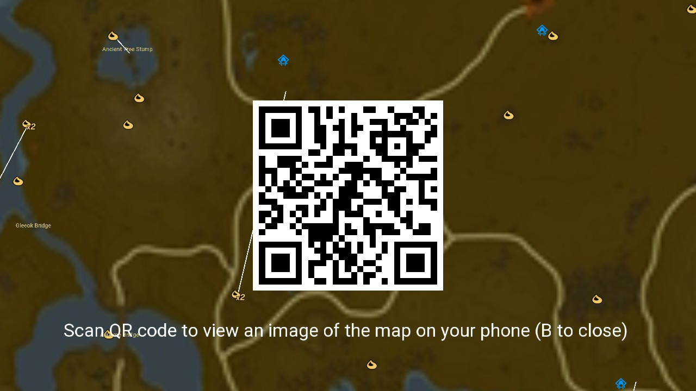
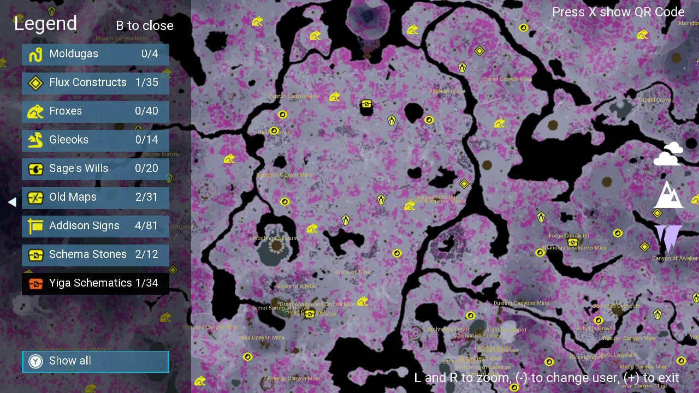
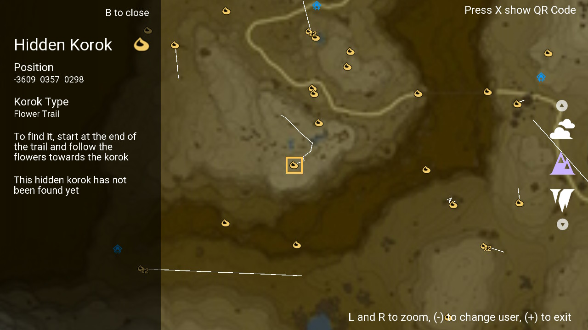

# Totk Unexplored
Easily view what hasn't been discovered in your Tears of the Kingdom savefile on your Nintendo Switch.

The korok seeds that haven't been collected, the locations that are left to visit and the 16 other types of unexplored collectibles are shown on a map, where it's easy to see what you've missed.

This is an updated version of [BotW Unexplored](https://github.com/lud99/botw-unexplored) that has a few new features but also so many small quality of life improvements that make the app much more plesant to use. 



## Main Features
- 18 types of collectibles can be tracked
    - Koroks
    - Shrines
    - Lightroots
    - Caves
    - Bubbuls
    - Wells
    - Chasms
    - Locations
    - Hinoxes
    - Taluses
    - Moldugas
    - Flux Constructs
    - Froxes
    - Gleeoks
    - Sage's Wills
    - Old Maps
    - Addison Signs
    - Schema Stones
    - Yiga Schematics

- Legend to easily toggle what collectibles to see and also to switch between showing missing, showing completed or showing all collectibles.
- Scan a Qr Code with your phone to see an image of the map to look at while playing. Only works if your switch and phone are connected to the same network.
- Object info about collectibles. Name, position, and what type of korok it is (if a korok) to help find it and what cave a Bubbul can be found in (if a bubbul)
- Backup system to be able to use the app while playing the game, as homebrew can't read savefiles of running games.
- Easily manually mark collectibles as found if using the app while playing the game. The manually marked collectibles are removed next time the app can read your savefile to avoid desync.
- "Korok paths" are drawn so it is easy to find koroks that involve flower trails, races and transporting a lonely korok back to its friend.
- Quickly swap between the Depths, Surface and Sky layers.
- Optimized the interface and experience for both touch and controller. 

## Screenshots





(more screenshots in [screenshots](/screenshots))

## Why?
There are many interactive maps online to track your progress, but nothing beats a map that automatically updates based on your progress. 
## Usage
Download ```totk-unexplored.nro``` from the [releases](https://github.com/lud99/totk-unexplored/releases), transfer it to your SD card and launch it. The app is also available on the [Homebrew App Store](https://apps.fortheusers.org/switch/TotKUnexplored) as TotK Unexplored 

Most things should be self explanitory, but here's some information just in case:

* Use the left analog sticks or the touch screen to move around.  
* Use L and R or the Y-axis on the right analog stick to zoom in and out. 
* Press B to open the legend and use either the touch screen or the D-pad to navigate the menu (note that the analog sticks won't work here). Change pages with the left-right dpad or the X-axis on the right analog stick. Press Y, or click the "Show all" button normally, to change the mode to showing missing, showing completed or showing all collectibles.
* Tap a collectibles, or move the cursor over it and press A, to see information about it. Here you can manually mark it as complete by pressing Y.
* \+ to exit, \- to switch profile.
* Press X anytime to show a Qr Code .
* Tap the layer icons on the right or use the Up-Down on the D-Pad to navigate between the layers.

## Qr Code
The Qr Code is a bit of an afterthought and might not function as you expect. The Qr Code contains a screenshot of the app at the moment you pressed X (except some text is ommited). That is why the code disapears when you move the camera, as it no longer represents your current screen. So, the image therefore sadly doesn't show the entire map or a high-res version of it, as the memory limitations in applet-mode make it too memory-intensive. So the QR Code mechanic is equivalent to taking a picture of the screen with your phone, but with the code you don't need to save the images on your phone.

### Where are the images stored?
To avoid using external services or my own database, the images the app generates are stored on the SD Card in switch/totk-unexplored. The app spins upp a very crude HTTP server in a seperate thread that can deliver the images and the QR Code is made to point to your switch's local ip adress and the map image. Therefore it only works if your switch and phone are connected to the same network. 

10 images can be saved before the app starts overriding your old images, so the image can still be seen for some time even between app restarts. Note that the http-server is not run as a sys-module so it only works when the app is running, but your phones web browser can still view the image as long as you don't refresh the page.

## Version History
### 1.0.4
* Updated to support the latest homebrew ABI (FW 21.0.0+)
* Updated to the latest libs (libnx 4.10.0+)
### 1.0.3
* Made loading of some (probably newer) savefiles work
### 1.0.2
* Added high resolution map images when using the app with title override (4500x4500 instead of 1500x1500)
* Removed 3 locations that are not required to be visited for 100% completion
### 1.0.1
* Fixed caves with multiple entrances not being marked correctly as found
* Fixed text overlap
* Disabled Qr Codes-feature when running the app with title override. See [this issue](https://github.com/lud99/totk-unexplored/issues/2) for more info 
### 1.0
* Initial release

## Building
switch-mesa, switch-glad, switch-freetype and switch-glm are required for building the project. Install them with the command ```pacman -S switch-mesa switch-glad switch-glm switch-freetype```  
Then run ```Make``` to build the .nro file.

### Credits
Huge thanks to these kind people / groups for making this project possible:

* https://github.com/marcrobledo/savegame-editors For most of the data used (savefile hashes and coordinates) and savefile parsing. Also thank you for taking your time to find out edge-cases and verifiying the data
* https://github.com/zeldamods/objmap-totk For being a great tool for debugging and for getting names for collectibles
* https://github.com/zeldamods/radar-totk For having data on all ingame objects so I could piece together the "korok paths"
* https://zeldadungeon.net For their amazing interactive map

##### Libraries
* https://github.com/nothings/stb For image loading and saving
* https://github.com/nayuki/QR-Code-generator For the QR-code creation
* https://github.com/nlohmann/json For parsing the gamedata from a JSON file
